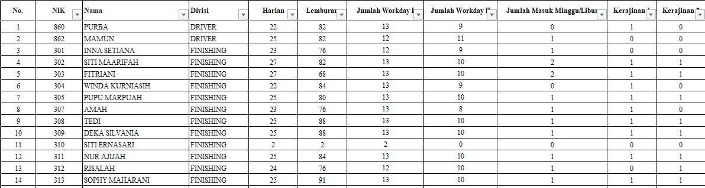

# Attendance Analysis

## Project Overview

This project is an Excel-based analysis of employee attendance data.

The goal is to process raw attendance records, calculate regular working hours and overtime, evaluate attendance consistency, and generate an employee-level attendance summary.

The workbook is designed to be reusable for different months by updating the attendance database and monthly parameters.

## Dataset

The dataset contains approximately 12,048 employee attendance records for Juli-August 2026.

The raw attendance data is organized into separate sheets based on employee division. Each division sheet follows the same attendance data structure.

### Raw Data Columns

| Column      | Description                  |
| ----------- | ---------------------------- |
| No. ID      | Employee ID                  |
| Nama        | Employee name                |
| Tanggal     | Attendance date              |
| Jam Kerja   | Scheduled working period     |
| Jam Masuk   | Scheduled clock-in time      |
| Jam Pulang  | Scheduled clock-out time     |
| Scan Masuk  | Actual clock-in time         |
| Scan Pulang | Actual clock-out time        |
| Riil        | Actual regular working hours |
| Lembur      | Actual overtime duration     |

### Working Hour Rules

* Sundays and holidays are treated as non-working days.
* Attendance on Sundays and holidays is tracked separately.

## Data Processing

Several helper columns are used to transform and prepare the raw attendance data for analysis.

### Set Tanggal

The original `Tanggal` column is stored as text rather than a proper Excel date.

A helper column called `Set Tanggal` converts the text value into an Excel date so that attendance records can be filtered and analyzed based on date ranges.

### Minggu/Libur

A helper column called `Minggu/Libur` identifies Sundays and holidays.

* `0` → Regular working day
* `1` → Sunday or holiday

This flag is used to distinguish regular working days from non-working days.

### Hitung Lembur

The raw `Lembur` value is recorded in `HH:MM` format.

Overtime is converted into calculated hours using the following rule:

* **00–49 minutes:** keep the current hour
* **50–59 minutes:** round up to the next hour

For example:

| Raw Overtime | Calculated Overtime |
| ------------ | ------------------: |
| 03:49        |                   3 |
| 03:50        |                   4 |
| 04:49        |                   4 |
| 04:50        |                   5 |

The `Hitung Lembur` helper column applies this rule before overtime hours are aggregated.

## Employee Summary

The processed data from each division is consolidated into a separate `REKAP` sheet.

The summary contains:

| Column      | Description                                                |
| ----------- | ---------------------------------------------------------- |
| No          | Row sequence                                               |
| NIK         | Employee ID                                                |
| Nama        | Employee name                                              |
| Divisi      | Employee division                                          |
| Harian      | Total actual regular working hours                         |
| Lemburan    | Total calculated overtime hours                            |
| Kerajinan 1 | Full attendance indicator for the first evaluation period  |
| Kerajinan 2 | Full attendance indicator for the second evaluation period |

### Harian

`Harian` represents the total regular working hours accumulated by each employee.

It is calculated by summing the `Riil` values for each employee across their attendance records.

### Lemburan

`Lemburan` represents the total calculated overtime hours accumulated by each employee.

The calculation uses the processed `Hitung Lembur` values from the raw attendance sheets.

### Kerajinan

`Kerajinan 1` and `Kerajinan 2` are binary attendance consistency indicators.

* `1` → Employee attended every scheduled working day during the evaluation period
* `0` → Employee missed at least one scheduled working day

Sundays and holidays are excluded from the expected working-day calculation.

## Monthly Parameters

The workbook includes a parameter section for the monthly attendance period.

The parameters include:

| Parameter                   | Description                               |
| --------------------------- | ----------------------------------------- |
| Bulan                       | Month number being analyzed               |
| Jumlah libur periode 1      | Number of additional holidays in Period 1 |
| Jumlah libur periode 2      | Number of additional holidays in Period 2 |
| Jumlah hari kerja periode 1 | Calculated working days for Period 1      |
| Jumlah hari kerja periode 2 | Calculated working days for Period 2      |

The expected number of working days is calculated dynamically based on the selected month and the number of holidays entered for each period.

This allows the workbook to be reused for another month without changing the employee-level formulas.

## Analysis Performed

* Calculate total regular working hours for each employee
* Calculate total overtime hours for each employee
* Identify employees with full attendance during each evaluation period
* Track attendance on Sundays and holidays
* Aggregate attendance data across multiple employee divisions
* Generate an employee-level attendance summary
* Dynamically calculate expected working days based on monthly parameters

## Excel Concepts Used

* Data Cleaning
* Data Formatting
* Date and Time Functions
* Conditional Logic
* `IF`
* `SUMIF`
* `SUMIFS`
* `COUNTIFS`
* `NETWORKDAYS.INTL`
* `INDIRECT`
* Helper Columns
* Multi-sheet Data Aggregation
* Parameter-driven calculations

## Project Output

The final output is an Excel-based employee attendance report containing:

* Employee information
* Division
* Total regular working hours
* Total overtime hours
* Attendance consistency indicators
* Attendance on Sundays and holidays

## Project Preview

### Employee Attendance Summary

## Key Questions

* How many regular working hours did each employee accumulate?
* How many overtime hours did each employee accumulate?
* Which employees maintained full attendance during each evaluation period?
* How many employees worked on Sundays or holidays?
* How can attendance data from multiple divisions be consolidated into one employee-level report?
* How can the attendance report be made reusable for different months?

## Tools

**Microsoft Excel**

* Excel Formulas
* Data Formatting
* Data Cleaning
* Multi-sheet Data Processing
* Attendance Analysis
